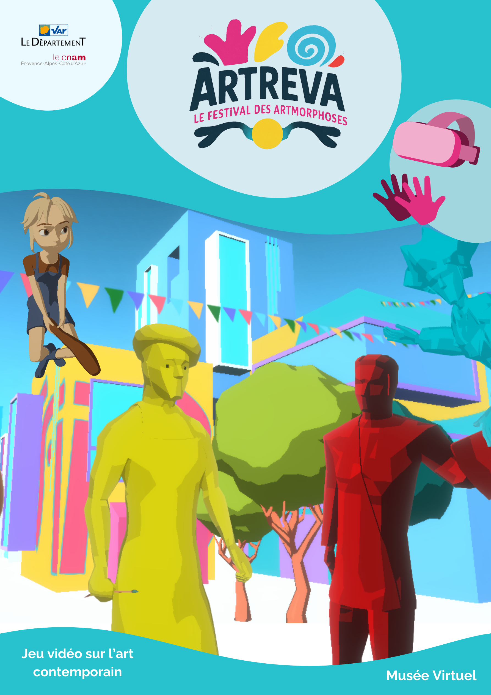
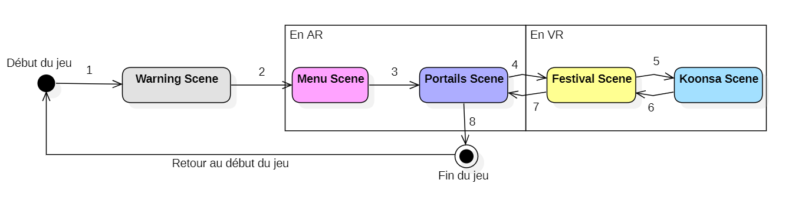
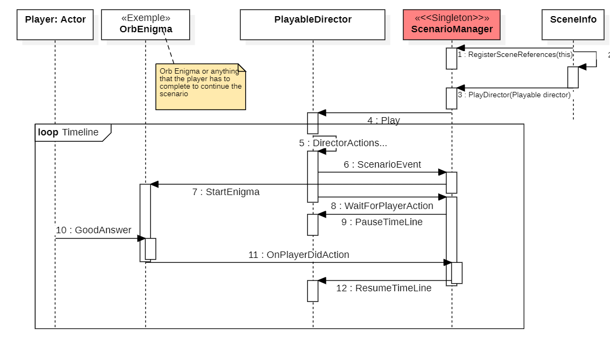
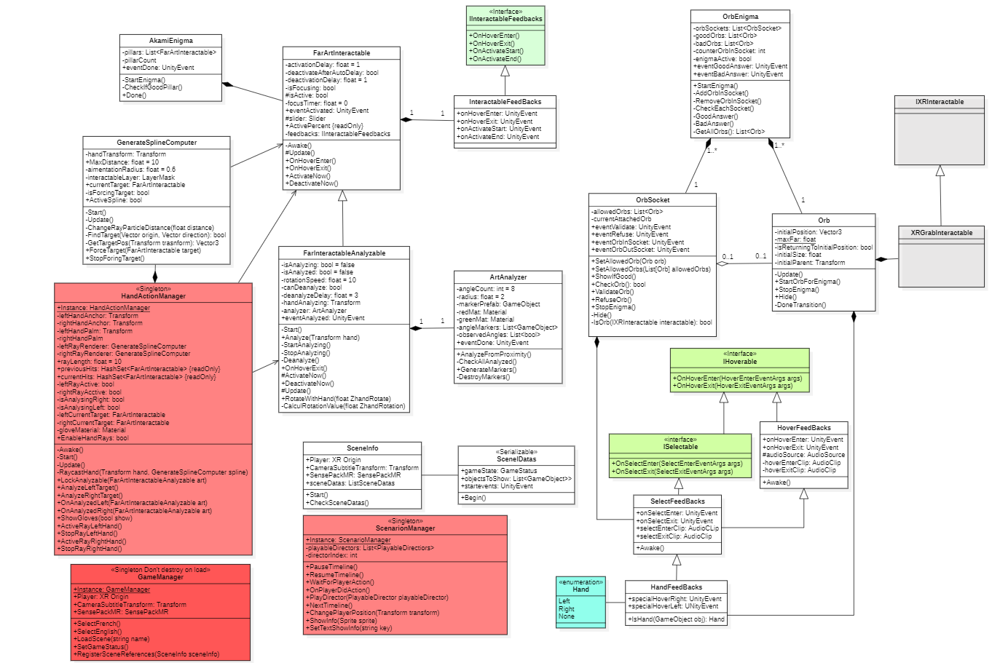

# ARTREVA  
## Festival des Artmorphoses  
### Projet VR – Musée Virtuel du Département du Var  
**PFE Ingénieur Informatique & Multimédia – CNAM PACA**

---

## 1. Présentation du projet

Artreva est une application VR développée dans le cadre du musée virtuel du Département du Var consacré à l'art contemporain.  



---

## 2. Environnement technique

- **Unity 6** – version `6000.0.47.f1`  
- **URP** (Universal Render Pipeline) configuré pour la VR  
- **Plateforme cible** : Pico 4 Ultra  
- **Langage** : C#  
- **Versioning** : Git (branches feature / develop / main)


## 3 Règles de l'application

Le jeu se joue **entièrement avec les mains** (tracking mains).  
Pour plus de détails, se référer au *document utilisateur*.

L'application se réinitialise automatiquement lorsque le casque reste **immobile ou posé plus de 10 secondes**.

Pour modifier cette durée :

Chemin :  
`Assets/Scripts/Managers/HeadsetPauseWatcher.cs`

Paramètre à ajuster :

```csharp
float graceSeconds = 10f;
``` 

## 4 Déroulement du Jeu

- Le jeu se déroule sur 5 scènes différentes. Le schéma suivant explique le déroulement.
- Le menu du jeu ainsi que la scène sur les portails avec Mira est normalement en Réalité Augmenté, le joueur voit des éléments 3D superposés à l'environnement autour de lui
- Après avoir réussi la première énigme sur l'art contemporain, le joueur rentre dans le festival, en Réalité Virtuelle. Il ne voit plus autour de lui.



---

## 5 BUILD : Configuration du keystore Android (Pico / Build APK)

1. Dans Unity, aller dans :  
   `Edit > Project Settings > Player > Publishing Settings`

2. Dans la section **Keystore** :
   - Renseigner le chemin du keystore
   - **Keystore password** : `i2lSud`
   - **Key alias** : `key1`
   - **Key password** : `i2lSud`


Si le message suivant apparaît lors du build :

`CommandInvokationFailure: Gradle build failed.`

- Vérifier en priorité que la **Key Password** renseignée est bien correcte
- Relancer ensuite le build.

---

## 6 Déroulement de scénario 

Une scène se déroule comme suit : 



- L'objet Scene Info possède un ensemble d'évenements à executer dès le Awake de la scène. Il donne au Scénario Mangager quel scénario exécuter.
- Une TimeLine se lance ensuite. 2 Signaux peuvent être envoyés au Scénario Manager pendant le déroulé d'une scène.
    -  **NextEvent (ou NextEventStep)** : `Va lancer le prochain event de la liste du ScénarioManager`
    -  **WaitForPlayerAction (ou PauseTimeline)** : `Met en pause la Timeline en attand une Action Joueur`
- Depuis n'importe quel Script, on peut appeler la fonction pour relancer la timeLine :
```csharp
    public void OnPlayerDidAction()
``` 
## 7 Diagramme de classe (UML)

- Voici le diagramme de classe simplifié de l'application. Il y a les scripts principaux. Il y en a d'autres dans le projets mais non liés aux autres ou moins nécessaires d'afficher...



##

Si problèmes de normals avec les Splines : Aller sur splineComputer, sélectionner N pour Normals, selection tous les points, selectionner LookUp-> Apply

