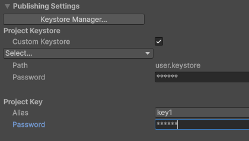

# ARTREVA  
## Festival des Artmorphoses  
### Projet VR – Musée Virtuel du Département du Var  
**PFE Ingénieur Informatique & Multimédia – CNAM PACA**

---

## 1. Présentation du projet

Artreva est une application VR développée dans le cadre du musée virtuel du Département du Var consacré à l'art contemporain.  

---

## 2. Environnement technique

- **Unity 6** – version `6000.0.47.f1`  
- **URP** (Universal Render Pipeline) configuré pour la VR  
- **Plateforme cible** : Pico 4 Ultra  
- **Langage** : C#  
- **Versioning** : Git (branches feature / develop / main)


## 3 Règles de l'application

Le jeu se joue **entièrement avec les mains** (tracking mains).  
Pour plus de détails, se référer au *document utilisateur*.

L'application se réinitialise automatiquement lorsque le casque reste **immobile ou posé plus de 10 secondes**.

Pour modifier cette durée :

Chemin :  
`Assets/Scripts/Managers/HeadsetPauseWatcher.cs`

Paramètre à ajuster :

```csharp
float graceSeconds = 10f;
``` 

---

## 4 BUILD : Configuration du keystore Android (Pico / Build APK)

1. Dans Unity, aller dans :  
   `Edit > Project Settings > Player > Publishing Settings`

2. Dans la section **Keystore** :
   - Renseigner le chemin du keystore
   - **Keystore password** : `i2lSud`
   - **Key alias** : `key1`
   - **Key password** : `i2lSud`



Si le message suivant apparaît lors du build :

`CommandInvokationFailure: Gradle build failed.`

- Vérifier en priorité que la **Key Password** renseignée est bien correcte
- Relancer ensuite le build.

---


Si problèmes de normals avec les Splines : Aller sur splineComputer, sélectionner N pour Normals, selection tous les points, selectionner LookUp-> Apply

